# Cellpose 3 Workflow

This document describes how to use Cellpose 3 within the neuronal cell
segmentation workflow of this repository.

Cellpose 3 is used when Cellpose-SAM under-detects neurons and when supervised
training is required to recover neurons identifiable by human inspection.

---

## 1. Environment Setup and Launch

This section ensures that Cellpose 3 is correctly installed and that the GUI
can be launched successfully. Once the GUI opens properly, you are ready to
begin segmentation.

### Create and Activate Environment

It is recommended to use a dedicated conda environment for Cellpose 3.

```bash
conda create -n cellpose3 python=3.10 -y
conda activate cellpose3
```
Install Pytorch
```
pip install torch torchvision torchaudio
```
Install Cellpose 3
```
pip install cellpose==3.0.11
```
### Install Cellpose with GUI Support

Install Cellpose including the graphical user interface:

```bash
python -m pip install 'cellpose[gui]'
```
If GPU acceleration is desired, make sure the appropriate CUDA-compatible
PyTorch version is installed on your system.

### Launch the Cellpose GUI

Start the Cellpose graphical interface with:

```bash
python -m cellpose
```
A window should open displaying the Cellpose GUI.

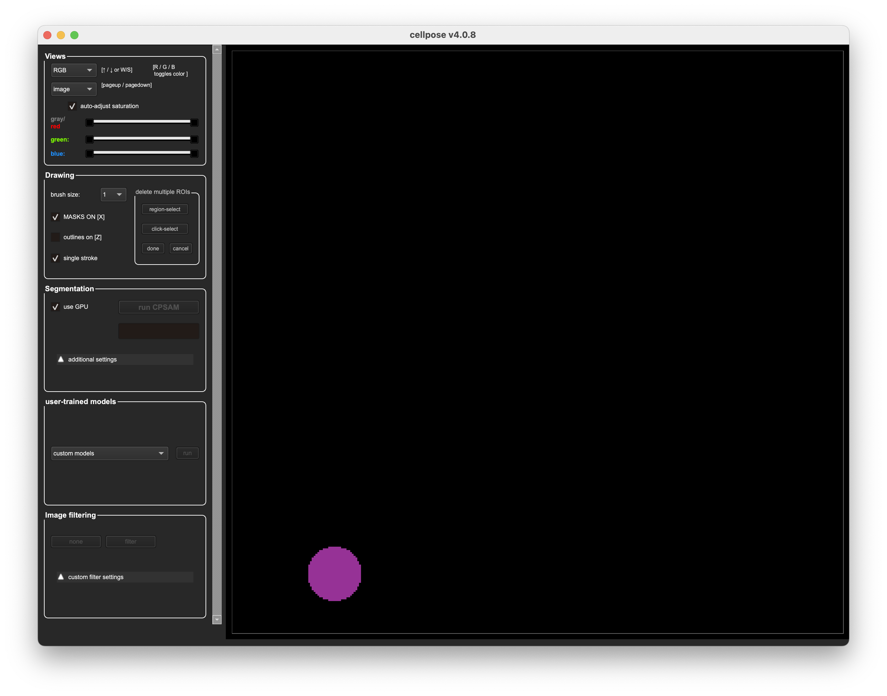

At this stage:
- No images need to be loaded
- No parameters need to be adjusted
- No models need to be selected


The purpose of this step is only to verify that Cellpose 3 is installed and
running correctly.
Once the GUI is open, proceed to loading data and basic visualization.

---

## 2. Load Data and Basic Visualization

This section covers how to load image data into the Cellpose GUI and how to
navigate the basic visualization modes. The goal is to become familiar with
the interface before running segmentation.

At this stage, it is not necessary to fully understand all views or settings.


### Load Image Data

Cellpose supports loading a single image or a folder of images.

To load data:
1. Open the Cellpose GUI
2. Click `File` → `Load image` to load a single image
   or
   drag the image directly into GUI - If the image you uploaded is inside a folder, GUI automatically identifies the whole folder and you can switch images when clicking the right or left button

Supported image formats include common microscopy formats such as `.tif` and
`.tiff`.

If a folder is loaded, images can be navigated using the left and right arrow
keys on the keyboard. Make sure the image display area is selected before
using the arrow keys.


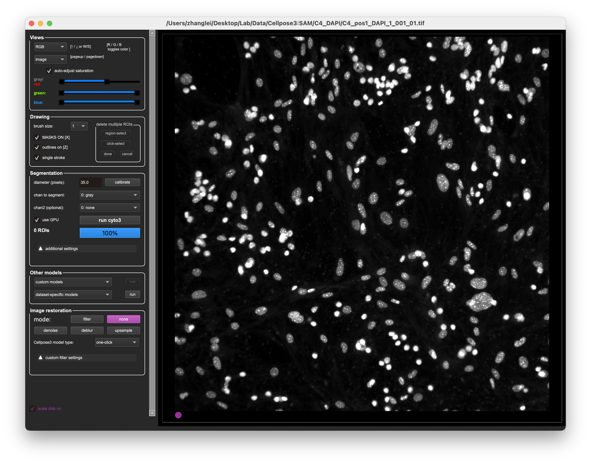


### Notes

- Do not adjust segmentation parameters at this stage
- Do not attempt to interpret the flow field in detail
- The purpose of this step is familiarity with the GUI and visualization only

Once the image is loaded and visible, proceed to running segmentation.

---


## 3. Run Segmentation (No Training)

This section describes how to run Cellpose 3 for segmentation without any
manual training. At this stage, Cellpose 3 is used only to generate a baseline
segmentation for comparison.

The goal is to assess whether Cellpose 3 can identify neurons that were missed
by Cellpose-SAM.


### Run Segmentation

To run segmentation:
1. Ensure an image is loaded
2. Use`ImageJ` or `FIJI` to measure the diameter of the cell and enter the number in the `segmentation`section showing `diameter(pixels):`
3. In`Views`, Use the appropriate view for your data, such as`RGB`, `Green`, `Blue` etc.
   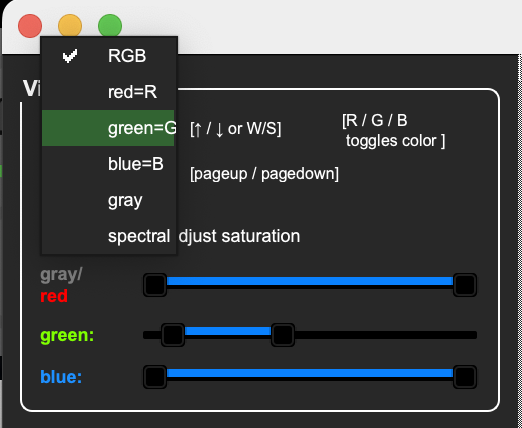
4. Choose a built-in model appropriate for your data
   - For most neuronal soma segmentation, the default cytoplasm model is sufficient
   - Do not select a trained custom model at this stage
   - Default model settings are usually adequate for initial segmentation
5. Choose the appropriate channels in `segmentations` accourding to your own channels used
6. Hit `calibrate` in `segmentations` 
7. Click the `Run cyto3` button in the GUI

Cellpose will process the image and display segmentation masks overlaid on the
original image.

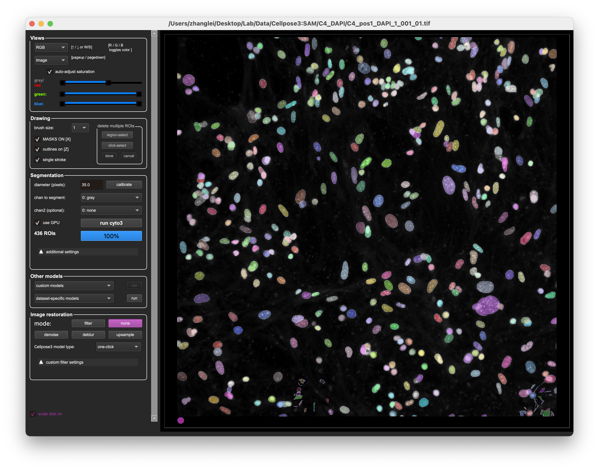

If you want a clearer image showing only the cells being segmented, you can go to `Views` and click onto `cellprob`

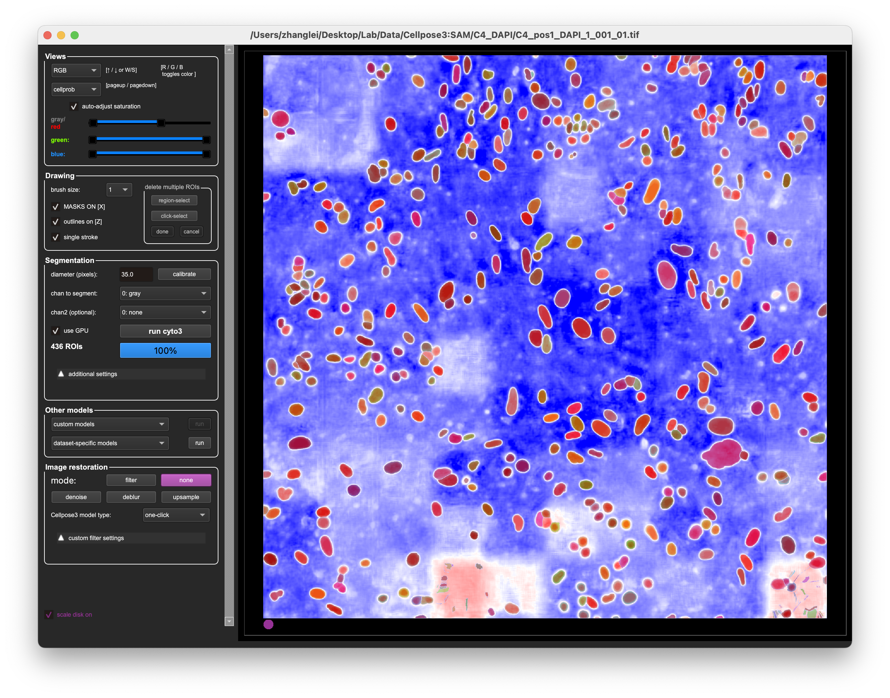

The `gradXY` view visualizes the internal flow field used by Cellpose to aggregate pixels toward cell centers. This view is primarily intended for model debugging and is not required for routine segmentation or manual correction in this workflow. Most users can safely ignore this view.
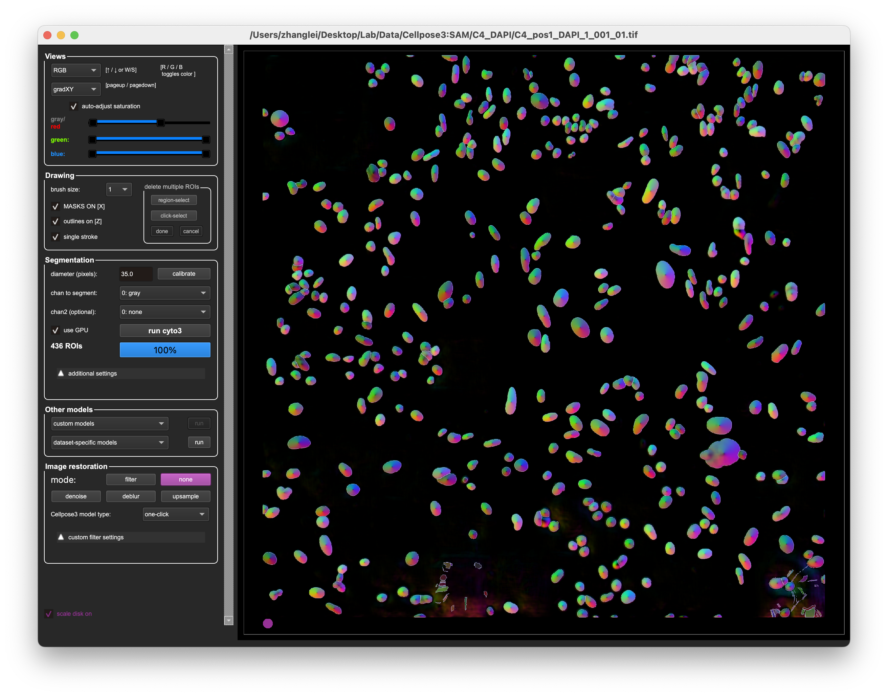


At this point:
- Segmentation results do not need to be perfect
- Boundary alignment does not need to be precise
- The primary focus is whether neurons are detected at all


### Initial Inspection

After segmentation, visually inspect the results.

Key questions to consider:
- Are neurons visible to the human eye detected?
- Are there obvious missed neurons?
- Are the detected regions reasonable in size and location?

Minor over-segmentation or boundary mismatch is acceptable.
Clear under-detection of identifiable neurons is not acceptable.

Do not perform manual correction yet. The purpose of this step is only to
generate a segmentation output for comparison.


### Notes

- Do not adjust advanced parameters unless segmentation is clearly unusable
- Do not begin training at this stage
- This step is intended as a fast baseline assessment

If the segmentation output appears reasonable, proceed to manual correction.
If clear under-detection is observed, manual correction and training will be
introduced in the next steps.

---

## 4. Manual Correction

This section describes how to manually correct segmentation results in Cellpose.
Manual correction is used to fix missed neurons and remove obvious false positives.

The purpose of manual correction is to identify neurons that are recognizable
by human inspection, not to achieve perfect boundary accuracy.


### When to Perform Manual Correction

Manual correction is performed when:
- Segmentation output misses neurons visible to the human eye
- Obvious false positive regions are present

Manual correction is not required when:
- Boundaries are slightly misaligned but neuron identity is correct
- Minor over-segmentation does not affect neuron identification


### Deleting False Positive ROIs

There are 2 ways to delete an incorrect ROI:
1. For deleting one ROI each time: Hold `command` and click on the target ROI (if you ae MAC user)/ Hold `ctrl` and click on the target ROI (if you ae Windows user)
2. For deleting multiple ROIs each time:
   - In `Drawing` click `region-select` or `click-select`
   - Click `done` after selection

The graph below shows using region select.

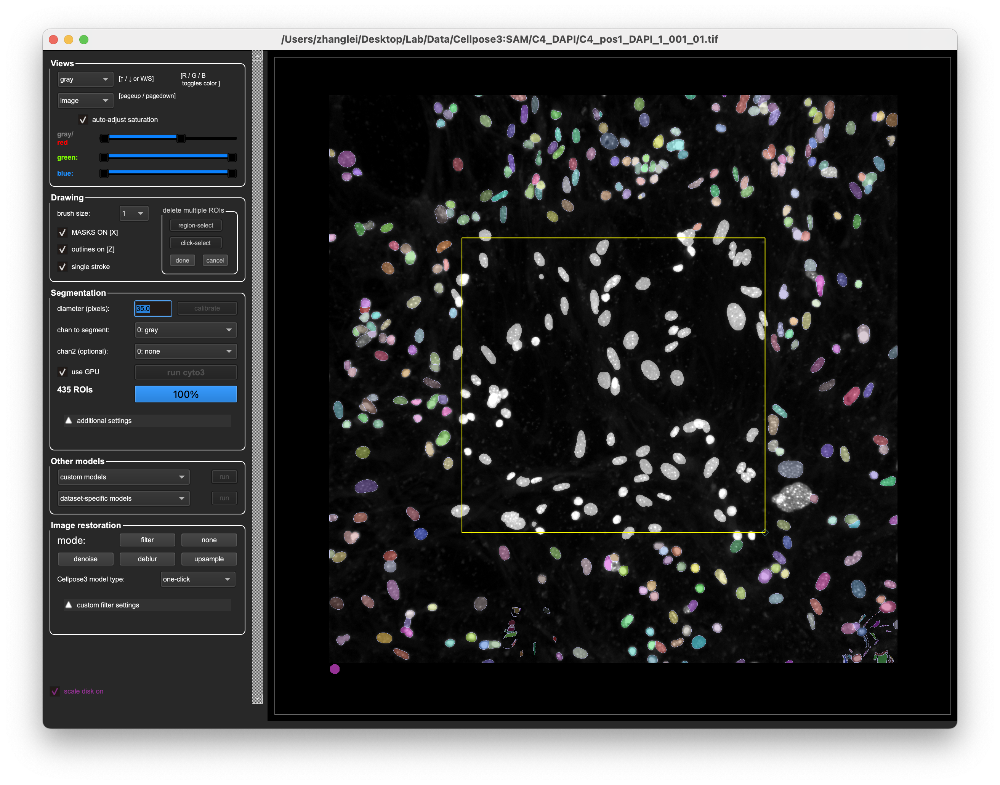

Removing false positives helps prevent incorrect regions from being included
in the training data.


### Adding Missed Neurons

To add a missed neuron:
1. Right-click near the boundary of the neuron
2. A red tracing circle will appear
3. Trace the approximate outline of the neuron
4. Complete the loop to create a new ROI mask

The traced boundary does not need to be precise.
The ROI only needs to capture the neuron as a distinct object.

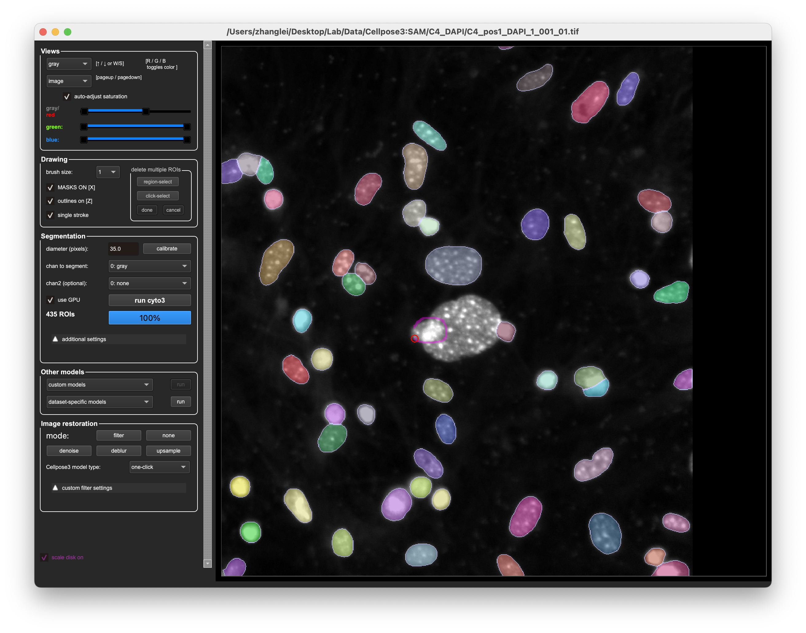

---


### Manual Correction Strategy

When performing manual correction:
- Focus on adding missed neurons first
- Remove only clearly incorrect ROIs
- Do not spend time refining boundaries
- Do not attempt to fix every minor imperfection

The goal is correctness of neuron identification, not visual perfection.


### Before and After Check

After manual correction:
- Compare the corrected segmentation with the original output
- Confirm that all neurons identifiable by human inspection are now included

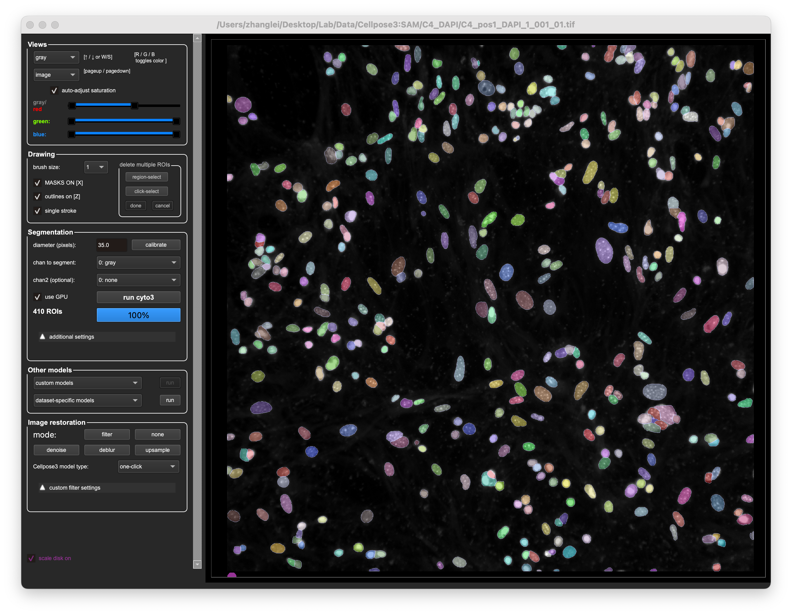

The corrected segmentation is treated as ground truth for training purposes.


### Notes

- Manual correction is expected to decrease over time as training improves
- Consistency in correction strategy is more important than precision
- Human judgment is central to this workflow

---

## 5. Train a Cellpose 3 Model

This section describes how to train a Cellpose 3 model using manually corrected
segmentation masks.

Training allows Cellpose 3 to learn dataset-specific features and reduce
under-detection in future segmentation runs.


### Prepare Training Data

Training data consists of:
- Original images
- Corresponding manually corrected masks (obtained from the last part)


### Launch Training in the GUI

To train a new model:
1. Have the manual corrected segmentation opened in the Cellpose GUI
2. Open the `Models` menu
3. Select the option to train a new model using images and masks in the folder

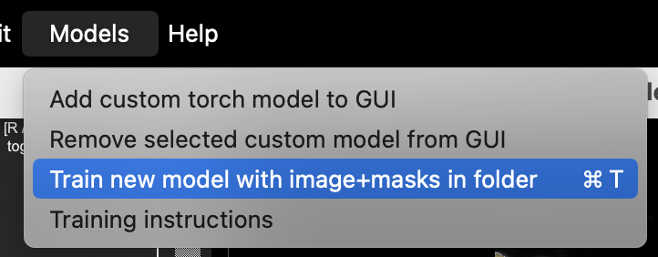


### Training Settings

When the training window opens:
- Use the default training parameters
- Do not modify learning rate, epochs, or normalization unless necessary
- Assign a descriptive name to the trained model

Default settings are sufficient for most neuronal datasets and help avoid
overfitting.

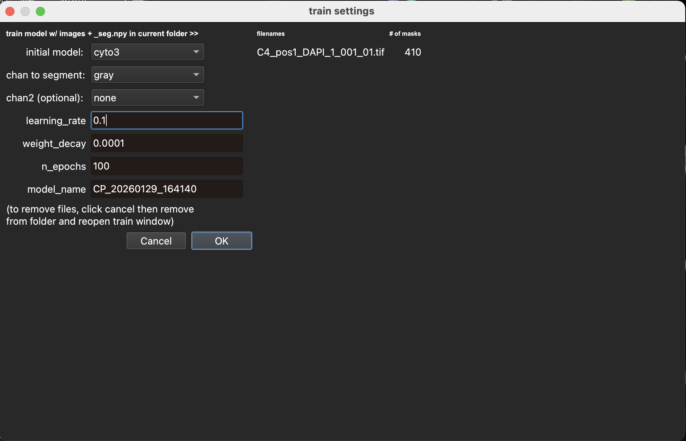


### Run Training

Start training and allow the process to complete.

During training:
- Progress will be displayed in the GUI
- No interaction is required

After training finishes:
- The trained model will be saved automatically
- The model will appear under user-trained models in the GUI

In practice, 4–5 images for training are often sufficient to see improvement in machine learning.


### Notes

- Training is performed periodically, not after every image
- Training focuses on reducing missed neurons
- More training data can be added incrementally over time

Once training is complete, the trained model can be applied to new images.

You may see this trained model in `Other models` convenient for later use.
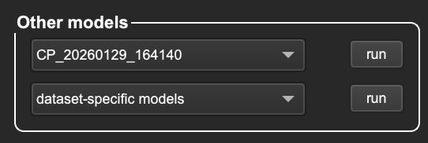
